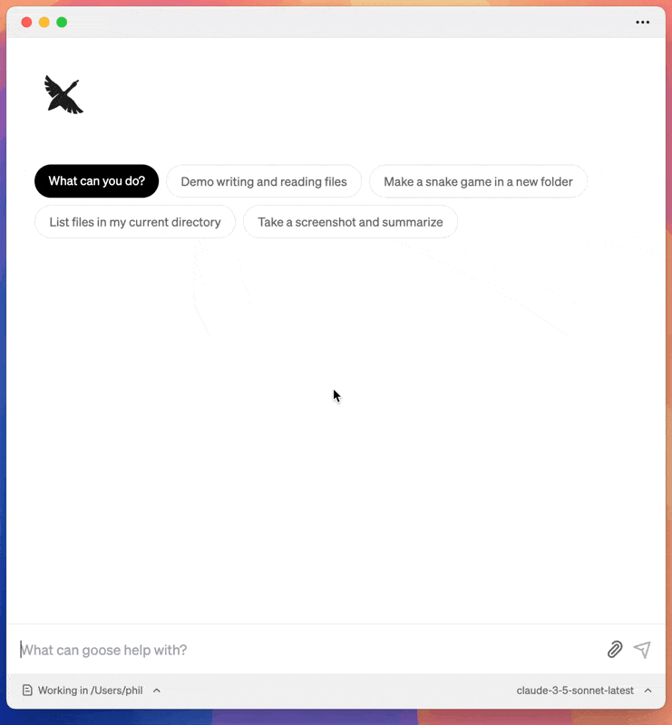
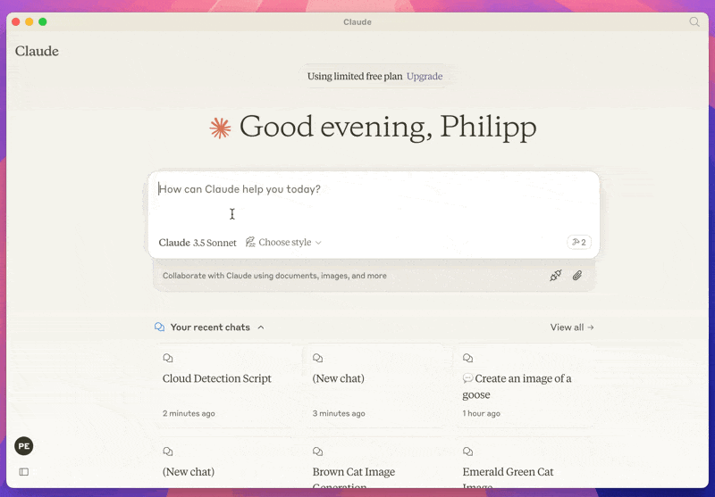
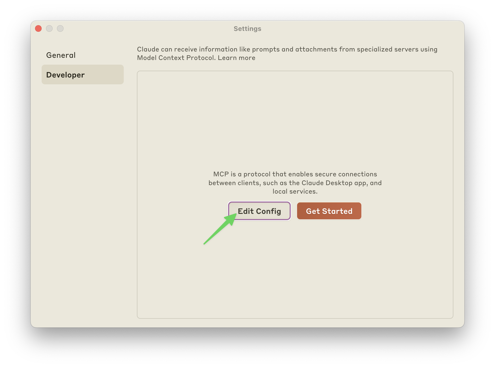
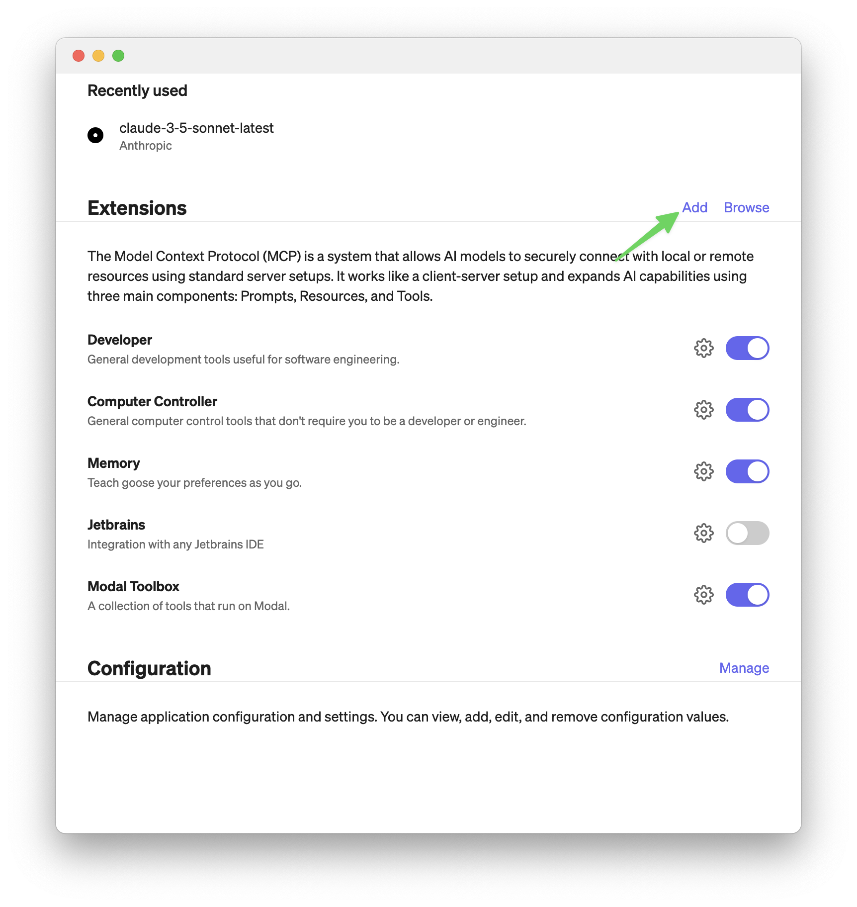
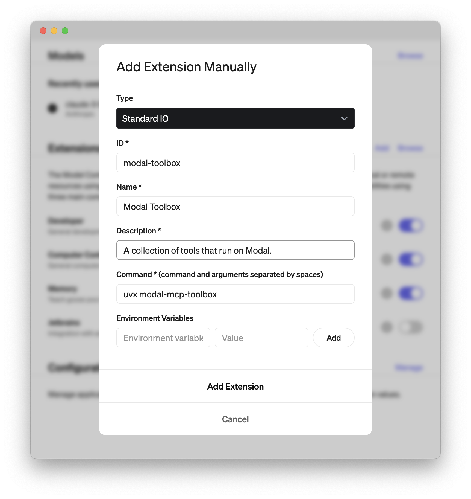

# Modal MCP Toolbox

A collection of Model Context Protocol (MCP) tools that run on Modal.
This let's you extend the capabilities of your LLM in tools such as [Goose](https://block.github.io/goose/) or the [Claude Desktop App](https://claude.ai/download).

## Tools

- `run_python_code_in_sandbox`: Let's you run python code in a sandboxed environment.
- `generate_flux_image`: Generate an image using the FLUX model.

## Demo

### Flux Image Generation



### Python Code Execution



## Installation

### Prerequisites

- A [modal account](https://modal.com/signup) and a configured modal CLI.
- [UV](https://github.com/astral-sh/uv?tab=readme-ov-file#installation)
- A client that supports MCP. Such as the [Claude Desktop App](https://claude.ai/download) or [Goose](https://block.github.io/goose/)

This runs against your modal account, so you will need to have a modal account and be logged in.

This depends on the client that uses the MCP. Here is instructions for Claude and Goose.

### Claude

Got to `Settings > Developer` in the Claude Desktop App. And click on Edit Config.


Add the config for the mcp server. My config looks like this:

```json
{
  "mcpServers": {
    "modal-toolbox": {
      "command": "uvx",
      "args": ["modal-mcp-toolbox"]
    }
  }
}
```

### Goose

Go to `Settings` and Click on Add.



Then add an extension like in the screenshot below.
The important part is to set command to:

```
uvx modal-mcp-toolbox
```

The rest you can fill in as you like.


